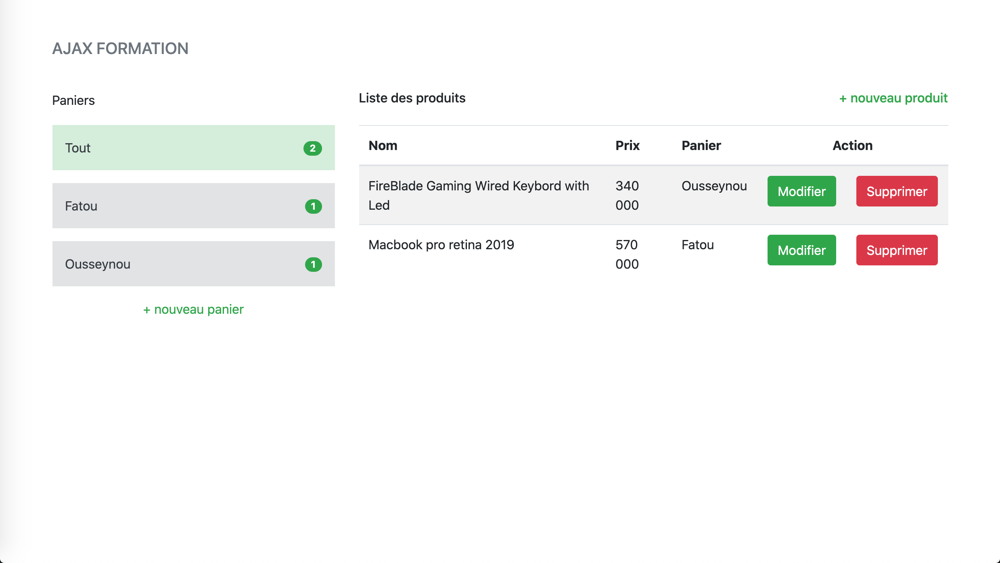

<!-- ABOUT THE PROJECT -->
## Playing whith full ROR-CRUD With AJAX.

<!-- ABOUT THE PROJECT -->
## About
  <p>Ruby version 2.3.8 or newer required to install the app</p>
  <ul>
    <li><a href="#">Bootstap Gem</a></li>
    <li><a href="#">Jquery Gem</a></li>
    <li><a href="#">will_paginate Gem ( Load 10 more Produits when scrolling )</a></li>
    <li><a href="#">Postgres on flag database</a></li>
  </ul>


## Screens:
<p align="center">
    
</p>

## Setup Project

Run these following commands after clone:

```
bundle i
```

```
rake db:create
```

```
rake db:migrate
```

```
rails server 
```


